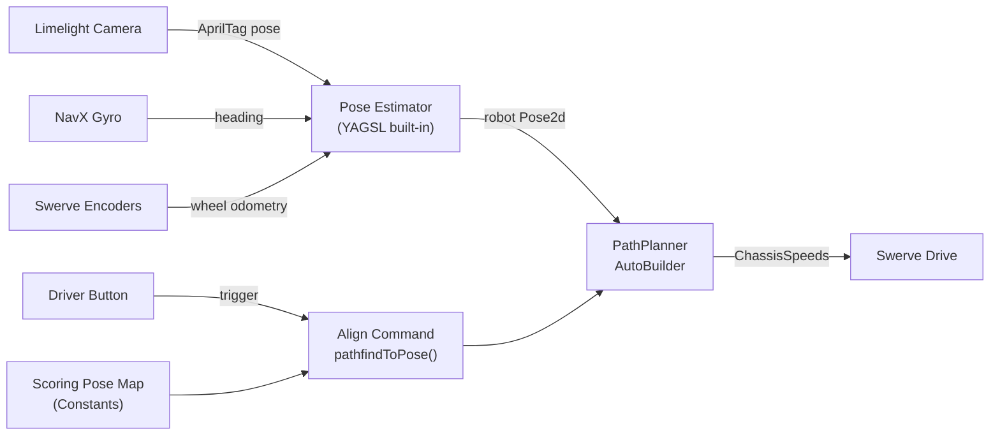

# Limelight AprilTag + PathPlanner Alignment Integration

## Overview

Complete the Limelight vision pose estimation that is partially implemented, configure PathPlanner's AutoBuilder for the YAGSL swerve drive, and create an alignment command framework that uses AprilTag-corrected odometry with PathPlanner's `pathfindToPose` to drive to scoring positions.

## Architecture



The idea: the Limelight sees AprilTags and tells the robot where it is on the field. That pose is fused with wheel odometry and the gyro so the robot always has an accurate position. Then PathPlanner uses that position to generate and follow a path to a pre-defined scoring pose.

## Files to Modify

| File | Changes |
|------|---------|
| `src/main/java/frc/robot/Constants.java` | Add `AutonConstants` PID values, add `FieldPositions` scoring poses |
| `src/main/java/frc/robot/subsystems/SwerveSubsystem.java` | Complete vision integration, configure PathPlanner AutoBuilder |
| `src/main/java/frc/robot/RobotContainer.java` | Add alignment command, bind to button, optionally enable auto chooser |

---

## What You Need to Provide (Measurements / Inputs)

Before implementation, you need to gather these values. Items marked **[HAVE]** are already in the code; items marked **[NEED]** are still required.

### Camera Mounting [HAVE -- verify accuracy]

Current values in `Constants.java` `VisionConstants`:

- X offset: 11.7" forward from robot center
- Y offset: -8.0" left/right from center
- Z offset: 13.2" height
- Pitch: 15 degrees, Roll: 0, Yaw: 0

**Action**: Physically re-measure these on the robot. Even small errors (1--2 inches) will cause the pose estimator to be inaccurate. Measure from the robot's center point to the camera lens. The Limelight needs to know *exactly* where it is mounted so it can translate "I see a tag at angle X,Y" into "the robot is at position X,Y on the field."

### Scoring Target Poses [NEED]

For each field element you want to align to, you need a `Pose2d` (x, y in meters on the WPILib Blue-origin field coordinate system, plus a heading angle). These represent where the robot should be positioned to score.

**Action**: Use the PathPlanner GUI app to look up field element positions on the field map, then define target poses offset from those elements (e.g., 18 inches in front of a reef branch, facing the branch). You can also drive the robot to the desired position manually, read the pose from SmartDashboard, and record it.

### Path-Following PID Constants [NEED]

PathPlanner requires two sets of PID constants:

- **Translation PID**: Controls how accurately the robot follows the X/Y path (start with P=5.0, I=0, D=0)
- **Rotation PID**: Controls how accurately the robot tracks heading (start with P=5.0, I=0, D=0)

These will need tuning on the real robot. The commented-out `AutonConstants` in `Constants.java` had P=0.7 translation / P=0.4 rotation -- those are reasonable starting points too.

### Robot Physical Constraints [HAVE]

- Max speed: 14.5 ft/s (4.42 m/s) -- already in `Constants.MAX_SPEED`
- Max module speed: Same as max speed for Krakens
- Drive base radius: ~16.3" (calculable from your 11.5" module offsets) -- YAGSL knows this

---

## Step 1: Add Constants

**File: `src/main/java/frc/robot/Constants.java`**

We need two new inner classes: `AutonConstants` for PID tuning values, and `FieldPositions` for the scoring target poses.

### 1a. Add the AutonConstants class

Find this commented-out block near the top of `Constants.java`:

```java
//  public static final class AutonConstants
//  {
//
//    public static final PIDConstants TRANSLATION_PID = new PIDConstants(0.7, 0, 0);
//    public static final PIDConstants ANGLE_PID       = new PIDConstants(0.4, 0, 0.01);
//  }
```

**Replace it with:**

```java
  public static final class AutonConstants
  {
    public static final double TRANSLATION_P = 5.0;
    public static final double TRANSLATION_I = 0.0;
    public static final double TRANSLATION_D = 0.0;

    public static final double ROTATION_P = 5.0;
    public static final double ROTATION_I = 0.0;
    public static final double ROTATION_D = 0.0;
  }
```

We store these as separate P, I, D doubles rather than a `PIDConstants` object so they're usable by both PathPlanner's `PIDConstants` class and WPILib's `PIDController` if needed.

### 1b. Add FieldPositions class

Add this new inner class inside `Constants.java`, right after the `AutonConstants` class you just added. These are **placeholder values** -- you will need to replace them with real field coordinates after measuring on the actual field.

```java
  public static final class FieldPositions
  {
    // TODO: Replace these placeholder Pose2d values with real measured positions.
    // All poses use the WPILib Blue-alliance origin coordinate system (meters + degrees).
    // PathPlanner automatically mirrors them for Red alliance.

    public static final Pose2d SCORE_LEFT = new Pose2d(
        new Translation2d(1.5, 1.0),
        Rotation2d.fromDegrees(0)
    );

    public static final Pose2d SCORE_CENTER = new Pose2d(
        new Translation2d(1.5, 2.5),
        Rotation2d.fromDegrees(0)
    );

    public static final Pose2d SCORE_RIGHT = new Pose2d(
        new Translation2d(1.5, 4.0),
        Rotation2d.fromDegrees(0)
    );
  }
```

The existing `AutoDestination` enum and empty `blueAuto_Map` in Constants could also be used for this, but a simple class with named `Pose2d` constants is easier to start with.

You will also need to add these imports at the top of `Constants.java` (some may already exist):

```java
import edu.wpi.first.math.geometry.Rotation2d;
import edu.wpi.first.math.geometry.Translation2d;
```

---

## Step 2: Complete Limelight Vision + PathPlanner in SwerveSubsystem

**File: `src/main/java/frc/robot/subsystems/SwerveSubsystem.java`**

The vision reading logic already exists in this file but is not being applied. The Limelight is read every cycle and the result is filtered, but the crucial `addVisionMeasurement()` call is commented out -- so vision data is gathered and thrown away. We also need to configure PathPlanner's `AutoBuilder` here since it needs direct access to the swerve drive.

### 2a. Add new imports

Add these imports at the top of the file (with the other imports). Some already exist -- only add the ones that are missing:

```java
import static edu.wpi.first.units.Units.Inches;
import static edu.wpi.first.units.Units.Degrees;

import com.pathplanner.lib.auto.AutoBuilder;
import com.pathplanner.lib.config.RobotConfig;
import com.pathplanner.lib.controllers.PPHolonomicDriveController;
import com.pathplanner.lib.controllers.PathFollowingController;
import com.pathplanner.lib.config.PIDConstants;
```

### 2b. Set camera pose at the end of the constructor

The Limelight needs to know where it's physically mounted on the robot so it can convert "I see a tag at this angle" into "the robot is at this field position." The `setCameraPose_RobotSpace` method sends the mounting position to the Limelight via NetworkTables.

Inside the `SwerveSubsystem(File directory)` constructor, **add the following block at the very end**, after the line `swerveDrive.setModuleEncoderAutoSynchronize(false, 1);` and before the closing `}` of the constructor:

```java
    // Tell the Limelight where the camera is mounted on the robot (meters and degrees).
    // Parameters: forward, side, up, roll, pitch, yaw
    LimelightHelpers.setCameraPose_RobotSpace(
        Constants.VisionConstants.OUTTAKE_LIMELIGHT_NAME,
        Constants.VisionConstants.OUTTAKE_LIMELIGHT_X_OFFSET.in(Inches) * 0.0254,
        Constants.VisionConstants.OUTTAKE_LIMELIGHT_Y_OFFSET.in(Inches) * 0.0254,
        Constants.VisionConstants.OUTTAKE_LIMELIGHT_Z_OFFSET.in(Inches) * 0.0254,
        Constants.VisionConstants.OUTTAKE_LIMELIGHT_ROLL_ANGLE.in(Degrees),
        Constants.VisionConstants.OUTTAKE_LIMELIGHT_PITCH_ANGLE.in(Degrees),
        Constants.VisionConstants.OUTTAKE_LIMELIGHT_YAW_ANGLE.in(Degrees)
    );
```

Note: `.in(Inches)` returns the value in inches, and we multiply by `0.0254` to convert to meters, because `setCameraPose_RobotSpace` expects meters for the position and degrees for the angles.

### 2c. Configure PathPlanner AutoBuilder

PathPlanner's `AutoBuilder` is the core integration point -- you configure it once, and then you can use `AutoBuilder.pathfindToPose()`, `AutoBuilder.followPath()`, and `AutoBuilder.buildAutoChooser()` anywhere in your code. It needs to know how to:
- Get the robot's current pose (from the pose estimator)
- Reset odometry (for autonomous starting positions)
- Get the robot's current velocity (for smooth path transitions)
- Drive the robot (by setting chassis speeds)

Still inside the same constructor, **add this block right after the camera pose block** from 2b above:

```java
    // Configure PathPlanner's AutoBuilder for autonomous path following.
    RobotConfig config;
    try {
      config = RobotConfig.fromGUISettings();
    } catch (Exception e) {
      e.printStackTrace();
      config = null;
    }

    if (config != null) {
      AutoBuilder.configure(
          this::getPose,
          this::resetOdometry,
          this::getRobotVelocity,
          (speeds, feedforwards) -> setChassisSpeeds(speeds),
          new PPHolonomicDriveController(
              new PIDConstants(
                  Constants.AutonConstants.TRANSLATION_P,
                  Constants.AutonConstants.TRANSLATION_I,
                  Constants.AutonConstants.TRANSLATION_D),
              new PIDConstants(
                  Constants.AutonConstants.ROTATION_P,
                  Constants.AutonConstants.ROTATION_I,
                  Constants.AutonConstants.ROTATION_D)
          ),
          config,
          () -> isRedAlliance(),
          this
      );
    }
```

> **Important note about `RobotConfig.fromGUISettings()`**: This reads a `pathplanner/settings.json` file from your deploy directory. You create this by:
> 1. Download and open the [PathPlanner desktop app](https://pathplanner.dev)
> 2. Open your robot project folder (`7272Rebuilt/`) in PathPlanner
> 3. Go to Settings and enter your robot's mass, MOI, bumper dimensions, and module config (gear ratio, wheel diameter, max speed, etc.)
> 4. Save -- this writes `src/main/deploy/pathplanner/settings.json`
>
> **If you haven't done this yet**, the try/catch will print an error but the robot code will still compile and run -- you just won't have path-following until you create the settings file. See Step 4 for the exact values to enter.

### 2d. Replace the `periodic()` method

This is where the vision integration actually happens. The existing `periodic()` reads a pose estimate from the Limelight but never feeds it into the pose estimator (the `addVisionMeasurement` call is commented out). We need to:

1. **Feed the gyro heading to the Limelight** via `SetRobotOrientation()` -- this enables MegaTag2, which uses the robot's known heading to produce far more accurate multi-tag pose estimates than MegaTag1
2. **Read the MegaTag2 pose estimate** via `getBotPoseEstimate_wpiBlue_MegaTag2()` instead of the old `getBotPoseEstimate_wpiBlue()`
3. **Filter the estimate** using the existing `filterPoseEstimate()` method (rejects results with no tags or tags too far away)
4. **Fuse it into the pose estimator** via `swerveDrive.addVisionMeasurement()` -- YAGSL's built-in method that combines vision with wheel odometry

Find the existing `periodic()` method (starts around line 132). **Replace the entire method** with:

```java
  @Override
  public void periodic()
  {
    // Feed the gyro heading to the Limelight for MegaTag2.
    // MegaTag2 uses the gyro to produce much more accurate multi-tag pose estimates.
    LimelightHelpers.SetRobotOrientation(
        Constants.VisionConstants.OUTTAKE_LIMELIGHT_NAME,
        swerveDrive.getOdometryHeading().getDegrees(),
        0, 0, 0, 0, 0
    );

    // Read the MegaTag2 pose estimate from the Limelight.
    LimelightHelpers.PoseEstimate poseEstimate = LimelightHelpers
        .getBotPoseEstimate_wpiBlue_MegaTag2(Constants.VisionConstants.OUTTAKE_LIMELIGHT_NAME);

    // Filter: reject if null, no tags, or all tags too far away.
    poseEstimate = filterPoseEstimate(poseEstimate);

    // Only fuse vision if gyro is not spinning too fast (high rotation = blurry image).
    if (poseEstimate != null && Math.abs(getGyroYawRate()) <= 720) {
      swerveDrive.addVisionMeasurement(
          poseEstimate.pose,
          poseEstimate.timestampSeconds
      );
    }
  }
```

The existing `filterPoseEstimate()` and `pickBestPoseEstimate()` helper methods can stay as-is. The filter is used above; `pickBestPoseEstimate` is there for when you add a second camera later.

### What the constructor should look like after all changes

For reference, here is the complete constructor after steps 2b and 2c are applied. The new lines are between the `=== NEW ===` markers:

```java
  public SwerveSubsystem(File directory)
  {
    SmartDashboard.putData("Field", drivefield);

    PathPlannerLogging.setLogActivePathCallback((poses) -> {
      drivefield.getObject("path").setPoses(poses);
    });
    PathPlannerLogging.setLogCurrentPoseCallback((pose) -> {
      drivefield.setRobotPose(pose);
    });
    PathPlannerLogging.setLogTargetPoseCallback((pose) -> drivefield.getObject("target pose").setPose(pose));

    boolean blueAlliance = false;
    Pose2d startingPose = blueAlliance ? new Pose2d(new Translation2d(Meter.of(1),
                                                                      Meter.of(4)),
                                                    Rotation2d.fromDegrees(0))
                                       : new Pose2d(new Translation2d(Meter.of(16),
                                                                      Meter.of(4)),
                                                    Rotation2d.fromDegrees(180));
    SwerveDriveTelemetry.verbosity = TelemetryVerbosity.HIGH;
    try
    {
      swerveDrive = new SwerveParser(directory).createSwerveDrive(Constants.MAX_SPEED, startingPose);
    } catch (Exception e)
    {
      throw new RuntimeException(e);
    }
    swerveDrive.setHeadingCorrection(false);
    swerveDrive.setCosineCompensator(false);
    swerveDrive.setAngularVelocityCompensation(true, true, 0.1);
    swerveDrive.setModuleEncoderAutoSynchronize(false, 1);

    // === NEW: Tell Limelight where the camera is mounted ===
    LimelightHelpers.setCameraPose_RobotSpace(
        Constants.VisionConstants.OUTTAKE_LIMELIGHT_NAME,
        Constants.VisionConstants.OUTTAKE_LIMELIGHT_X_OFFSET.in(Inches) * 0.0254,
        Constants.VisionConstants.OUTTAKE_LIMELIGHT_Y_OFFSET.in(Inches) * 0.0254,
        Constants.VisionConstants.OUTTAKE_LIMELIGHT_Z_OFFSET.in(Inches) * 0.0254,
        Constants.VisionConstants.OUTTAKE_LIMELIGHT_ROLL_ANGLE.in(Degrees),
        Constants.VisionConstants.OUTTAKE_LIMELIGHT_PITCH_ANGLE.in(Degrees),
        Constants.VisionConstants.OUTTAKE_LIMELIGHT_YAW_ANGLE.in(Degrees)
    );

    // === NEW: Configure PathPlanner AutoBuilder ===
    RobotConfig config;
    try {
      config = RobotConfig.fromGUISettings();
    } catch (Exception e) {
      e.printStackTrace();
      config = null;
    }

    if (config != null) {
      AutoBuilder.configure(
          this::getPose,
          this::resetOdometry,
          this::getRobotVelocity,
          (speeds, feedforwards) -> setChassisSpeeds(speeds),
          new PPHolonomicDriveController(
              new PIDConstants(
                  Constants.AutonConstants.TRANSLATION_P,
                  Constants.AutonConstants.TRANSLATION_I,
                  Constants.AutonConstants.TRANSLATION_D),
              new PIDConstants(
                  Constants.AutonConstants.ROTATION_P,
                  Constants.AutonConstants.ROTATION_I,
                  Constants.AutonConstants.ROTATION_D)
          ),
          config,
          () -> isRedAlliance(),
          this
      );
    }
    // === END NEW ===
  }
```

---

## Step 3: Add Alignment Command and Button Binding

**File: `src/main/java/frc/robot/RobotContainer.java`**

Now that AutoBuilder is configured and vision is feeding the pose estimator, we can create a command that uses `AutoBuilder.pathfindToPose()` to drive the robot to a scoring position. This is the "on-the-fly pathfinding" feature of PathPlanner -- given any target `Pose2d` on the field, it dynamically generates a path from wherever the robot currently is and follows it. No pre-drawn paths needed.

### 3a. Add new imports

Add these imports at the top of the file:

```java
import com.pathplanner.lib.auto.AutoBuilder;
import com.pathplanner.lib.path.PathConstraints;
import frc.robot.Constants.FieldPositions;
```

### 3b. Add the alignment helper method

Add this method to the `RobotContainer` class (for example, right before the `getAutonomousCommand()` method):

```java
  /**
   * Creates a command that pathfinds the robot to a target scoring pose.
   * Uses PathPlanner's on-the-fly path generation.
   *
   * @param targetPose The field-relative pose to drive to (Blue alliance origin).
   * @return A Command that drives the robot to the target.
   */
  private Command alignToPose(Pose2d targetPose) {
    PathConstraints constraints = new PathConstraints(
        3.0,                              // max velocity (m/s) -- slower than full speed for precision
        3.0,                              // max acceleration (m/s^2)
        Units.degreesToRadians(540),      // max angular velocity (rad/s)
        Units.degreesToRadians(720)       // max angular acceleration (rad/s^2)
    );
    return AutoBuilder.pathfindToPose(
        targetPose,
        constraints,
        0.0   // goal end velocity (m/s) -- stop at the target
    );
  }
```

The `PathConstraints` control how aggressively the robot moves during alignment. 3.0 m/s is about 70% of max speed -- fast enough to be useful, slow enough to be controllable. You can tune these values. The rotation component of the target `Pose2d` controls what heading the robot will have when it arrives (e.g., facing the scoring element).

### 3c. Bind alignment to a button

Inside the `configureBindings()` method, in the `else` block (the non-test-mode block, around line 248), find these lines that currently do nothing:

```java
      driverXbox.start().whileTrue(Commands.none());
      driverXbox.back().whileTrue(Commands.none());
```

**Replace them with:**

```java
      // Hold START to pathfind to the center scoring position.
      // Change FieldPositions.SCORE_CENTER to any other pose as needed.
      driverXbox.start().whileTrue(alignToPose(FieldPositions.SCORE_CENTER));

      // Hold BACK to pathfind to the left scoring position.
      driverXbox.back().whileTrue(alignToPose(FieldPositions.SCORE_LEFT));
```

`whileTrue` means the robot pathfinds as long as the button is held. Releasing the button cancels the command and returns to normal driver control (the default drive command resumes). This is a safe default -- the driver can always let go to regain control.

### 3d. (Optional) Enable PathPlanner auto chooser

Once AutoBuilder is configured, you can use PathPlanner's auto chooser to select full autonomous routines created in the PathPlanner GUI. This replaces the manual `SendableChooser` setup you currently have.

In the `RobotContainer()` constructor, find these commented-out lines:

```java
        //  autoChooser = AutoBuilder.buildAutoChooser();
        //         SmartDashboard.putData("Auto Chooser", autoChooser);
```

To enable this, change the field declaration from:

```java
 private final SendableChooser<Command> autoChooser = new SendableChooser<>();
```

To:

```java
  private SendableChooser<Command> autoChooser;
```

Then in the constructor, replace the manual `autoChooser` setup block:

```java
    autoChooser.setDefaultOption("Do Nothing", Commands.runOnce(drivebase::zeroGyroWithAlliance)
                                                    .andThen(Commands.none()));
    autoChooser.addOption("Drive Forward", Commands.runOnce(drivebase::zeroGyroWithAlliance).withTimeout(.2)
                                                .andThen(drivebase.driveForward().withTimeout(1)));
    SmartDashboard.putData("Auto Chooser", autoChooser);
```

With:

```java
    autoChooser = AutoBuilder.buildAutoChooser();
    SmartDashboard.putData("Auto Chooser", autoChooser);
```

**Only do this after** you have PathPlanner fully configured (Step 2c works, and you have created at least one `.auto` file in the PathPlanner GUI). If AutoBuilder isn't configured, `buildAutoChooser()` will throw an exception.

---

## Step 4: Create PathPlanner Project Settings

This step is done **outside of code**, in the PathPlanner desktop application. The `RobotConfig.fromGUISettings()` call in Step 2c reads its configuration from a file that PathPlanner generates.

1. Download PathPlanner from https://pathplanner.dev (if not already installed)
2. Open PathPlanner and select your project folder: `7272Rebuilt/`
3. Go to **Settings** (gear icon) and enter:
   - **Robot mass**: ~58 kg (your `ROBOT_MASS` constant)
   - **Robot MOI**: Start with ~6.0 kg*m^2 (moment of inertia -- estimate for a square robot)
   - **Bumper size**: Your robot's bumper-to-bumper dimensions
   - **Module config**:
     - **Drive gear ratio**: 5.5 (from your YAGSL swerve config)
     - **Wheel radius**: 1.5 inches = 0.0381 m (3-inch wheel diameter / 2)
     - **Max drive speed**: 4.42 m/s (your `MAX_SPEED`)
     - **Drive motor**: Kraken X60
     - **Drive current limit**: 40A (typical starting value)
4. Click **Save** -- this creates `src/main/deploy/pathplanner/settings.json`
5. PathPlanner will also create `src/main/deploy/pathplanner/navgrid.json` with the field obstacle map (used by the pathfinding algorithm to avoid field elements)

---

## Checklist

- [ ] **Step 1a**: Uncomment and update `AutonConstants` in `Constants.java`
- [ ] **Step 1b**: Add `FieldPositions` class with placeholder `Pose2d` values to `Constants.java`
- [ ] **Step 2a**: Add PathPlanner imports to `SwerveSubsystem.java`
- [ ] **Step 2b**: Add `setCameraPose_RobotSpace()` call at end of constructor
- [ ] **Step 2c**: Add `AutoBuilder.configure()` call at end of constructor
- [ ] **Step 2d**: Replace `periodic()` method with the MegaTag2 vision integration
- [ ] **Step 3a**: Add PathPlanner imports to `RobotContainer.java`
- [ ] **Step 3b**: Add `alignToPose()` helper method to `RobotContainer`
- [ ] **Step 3c**: Bind alignment commands to START and BACK buttons
- [ ] **Step 4**: Configure PathPlanner desktop app and save project settings
- [ ] **Verify**: Code compiles with `./gradlew build`
- [ ] **On robot**: Verify Limelight sees AprilTags (check SmartDashboard for pose data)
- [ ] **On robot**: Verify the Field2d widget shows the robot in the correct position
- [ ] **On robot**: Test alignment button -- robot should drive toward the target pose
- [ ] **Tune**: Adjust PID values in `AutonConstants` if path following is inaccurate
- [ ] **Measure**: Replace placeholder `FieldPositions` poses with real scoring positions

---

## Summary of What You Need to Measure / Decide

1. **Verify camera mount offsets** (X, Y, Z, pitch) by physically measuring on the robot
2. **Decide scoring target poses** -- drive robot to desired positions and record the `Pose2d`, or look up coordinates in the PathPlanner field map
3. **Choose which driver button** triggers alignment (currently START and BACK)
4. **Tune PID values** on the real robot (start with the defaults provided, adjust from there)
5. **Optionally**: Download and run the PathPlanner GUI desktop app, create a project for your robot, and configure the robot settings (mass, dimensions) -- this is needed if you want to use `RobotConfig.fromGUISettings()` or create GUI-authored auto paths

---

## Troubleshooting

| Problem | Likely Cause | Fix |
|---------|-------------|-----|
| `RobotConfig.fromGUISettings()` throws exception | No `pathplanner/settings.json` in deploy | Open project in PathPlanner GUI and save settings (Step 4) |
| Robot pose on Field2d is wrong / jumping | Camera mount offsets are incorrect | Re-measure X, Y, Z, pitch from robot center to camera lens |
| Robot doesn't move when alignment button pressed | AutoBuilder not configured (config was null) | Check console for the `e.printStackTrace()` output from Step 2c |
| Robot follows path but overshoots / oscillates | PID values need tuning | Lower Translation P or Rotation P in `AutonConstants` |
| Vision estimate rejected every cycle | Gyro yaw rate > 720 or no tags in view | Make sure Limelight pipeline is set to AprilTag mode and tags are close enough (<3.48m) |
