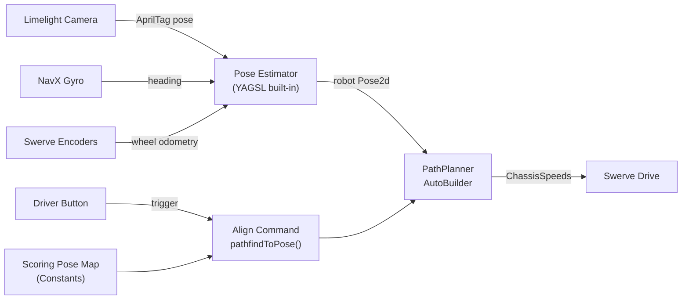

# Limelight AprilTag + PathPlanner Alignment Integration

## Overview

Complete the Limelight vision pose estimation that is partially implemented, configure PathPlanner's AutoBuilder for the YAGSL swerve drive, and create an alignment command framework that uses AprilTag-corrected odometry with PathPlanner's `pathfindToPose` to drive to scoring positions.

## Architecture



---

## Measurements / Inputs You Need to Provide

| Item | Status | What to do |
|------|--------|------------|
| Camera mount position (X, Y, Z, pitch, roll, yaw) | **HAVE** - verify accuracy | Re-measure from robot center to camera lens in inches. Current values are in `Constants.VisionConstants`. |
| Scoring target `Pose2d` values | **NEED** | Drive robot to each desired scoring position, read pose from SmartDashboard, and record it. Or use the PathPlanner GUI field map. |
| Translation PID (P, I, D) | **NEED** | Start with `P=5.0, I=0, D=0`. Tune on real robot. |
| Rotation PID (P, I, D) | **NEED** | Start with `P=5.0, I=0, D=0`. Tune on real robot. |
| Max speed / max accel | **HAVE** | Already defined as 14.5 ft/s in `Constants.MAX_SPEED`. |

---

## Step 1: Add Constants

**File: `src/main/java/frc/robot/Constants.java`**

### 1a. Add the AutonConstants class

Find this commented-out block near the top of `Constants.java`:

```java
//  public static final class AutonConstants
//  {
//
//    public static final PIDConstants TRANSLATION_PID = new PIDConstants(0.7, 0, 0);
//    public static final PIDConstants ANGLE_PID       = new PIDConstants(0.4, 0, 0.01);
//  }
```

**Replace it with:**

```java
  public static final class AutonConstants
  {
    public static final double TRANSLATION_P = 5.0;
    public static final double TRANSLATION_I = 0.0;
    public static final double TRANSLATION_D = 0.0;

    public static final double ROTATION_P = 5.0;
    public static final double ROTATION_I = 0.0;
    public static final double ROTATION_D = 0.0;
  }
```

### 1b. Add FieldPositions class

Add this new inner class inside `Constants.java`, right after the `AutonConstants` class you just added. These are **placeholder values** -- you will need to replace them with real field coordinates after measuring.

```java
  public static final class FieldPositions
  {
    // TODO: Replace these placeholder Pose2d values with real measured positions.
    // All poses use the WPILib Blue-alliance origin coordinate system (meters + degrees).
    // PathPlanner automatically mirrors them for Red alliance.

    public static final Pose2d SCORE_LEFT = new Pose2d(
        new Translation2d(1.5, 1.0),
        Rotation2d.fromDegrees(0)
    );

    public static final Pose2d SCORE_CENTER = new Pose2d(
        new Translation2d(1.5, 2.5),
        Rotation2d.fromDegrees(0)
    );

    public static final Pose2d SCORE_RIGHT = new Pose2d(
        new Translation2d(1.5, 4.0),
        Rotation2d.fromDegrees(0)
    );
  }
```

You will also need to add these imports at the top of `Constants.java` (some may already exist):

```java
import edu.wpi.first.math.geometry.Rotation2d;
import edu.wpi.first.math.geometry.Translation2d;
```

---

## Step 2: Complete Limelight Vision in SwerveSubsystem

**File: `src/main/java/frc/robot/subsystems/SwerveSubsystem.java`**

### 2a. Add new imports

Add these imports at the top of the file (with the other imports). Some already exist -- only add the ones that are missing:

```java
import static edu.wpi.first.units.Units.Inches;
import static edu.wpi.first.units.Units.Degrees;

import com.pathplanner.lib.auto.AutoBuilder;
import com.pathplanner.lib.config.RobotConfig;
import com.pathplanner.lib.controllers.PPHolonomicDriveController;
import com.pathplanner.lib.controllers.PathFollowingController;
import com.pathplanner.lib.config.PIDConstants;
```

### 2b. Set camera pose at the end of the constructor

Inside the `SwerveSubsystem(File directory)` constructor, **add the following block at the very end**, after the line `swerveDrive.setModuleEncoderAutoSynchronize(false, 1);` and before the closing `}` of the constructor:

```java
    // Tell the Limelight where the camera is mounted on the robot (meters and degrees).
    // Parameters: forward, side, up, roll, pitch, yaw
    LimelightHelpers.setCameraPose_RobotSpace(
        Constants.VisionConstants.OUTTAKE_LIMELIGHT_NAME,
        Constants.VisionConstants.OUTTAKE_LIMELIGHT_X_OFFSET.in(Inches) * 0.0254,
        Constants.VisionConstants.OUTTAKE_LIMELIGHT_Y_OFFSET.in(Inches) * 0.0254,
        Constants.VisionConstants.OUTTAKE_LIMELIGHT_Z_OFFSET.in(Inches) * 0.0254,
        Constants.VisionConstants.OUTTAKE_LIMELIGHT_ROLL_ANGLE.in(Degrees),
        Constants.VisionConstants.OUTTAKE_LIMELIGHT_PITCH_ANGLE.in(Degrees),
        Constants.VisionConstants.OUTTAKE_LIMELIGHT_YAW_ANGLE.in(Degrees)
    );
```

### 2c. Configure PathPlanner AutoBuilder

Still inside the same constructor, **add this block right after the camera pose block** from 2b above:

```java
    // Configure PathPlanner's AutoBuilder for autonomous path following.
    RobotConfig config;
    try {
      config = RobotConfig.fromGUISettings();
    } catch (Exception e) {
      e.printStackTrace();
      config = null;
    }

    if (config != null) {
      AutoBuilder.configure(
          this::getPose,
          this::resetOdometry,
          this::getRobotVelocity,
          (speeds, feedforwards) -> setChassisSpeeds(speeds),
          new PPHolonomicDriveController(
              new PIDConstants(
                  Constants.AutonConstants.TRANSLATION_P,
                  Constants.AutonConstants.TRANSLATION_I,
                  Constants.AutonConstants.TRANSLATION_D),
              new PIDConstants(
                  Constants.AutonConstants.ROTATION_P,
                  Constants.AutonConstants.ROTATION_I,
                  Constants.AutonConstants.ROTATION_D)
          ),
          config,
          () -> isRedAlliance(),
          this
      );
    }
```

> **Important note about `RobotConfig.fromGUISettings()`**: This requires a `pathplanner/settings.json` file in your deploy directory. You create this by:
> 1. Download and open the [PathPlanner desktop app](https://pathplanner.dev)
> 2. Open your robot project folder (`7272Rebuilt/`) in PathPlanner
> 3. Go to Settings and enter your robot's mass, MOI, bumper dimensions, and module config (gear ratio, wheel diameter, max speed, etc.)
> 4. Save -- this writes `src/main/deploy/pathplanner/settings.json`
>
> **If you haven't done this yet**, the try/catch will print an error but the robot code will still compile and run -- you just won't have path-following until you create the settings file.

### 2d. Replace the `periodic()` method

Find the existing `periodic()` method (starts around line 132). **Replace the entire method** with:

```java
  @Override
  public void periodic()
  {
    // Feed the gyro heading to the Limelight for MegaTag2.
    // MegaTag2 uses the gyro to produce much more accurate multi-tag pose estimates.
    LimelightHelpers.SetRobotOrientation(
        Constants.VisionConstants.OUTTAKE_LIMELIGHT_NAME,
        swerveDrive.getOdometryHeading().getDegrees(),
        0, 0, 0, 0, 0
    );

    // Read the MegaTag2 pose estimate from the Limelight.
    LimelightHelpers.PoseEstimate poseEstimate = LimelightHelpers
        .getBotPoseEstimate_wpiBlue_MegaTag2(Constants.VisionConstants.OUTTAKE_LIMELIGHT_NAME);

    // Filter: reject if null, no tags, or all tags too far away.
    poseEstimate = filterPoseEstimate(poseEstimate);

    // Only fuse vision if gyro is not spinning too fast (high rotation = blurry image).
    if (poseEstimate != null && Math.abs(getGyroYawRate()) <= 720) {
      swerveDrive.addVisionMeasurement(
          poseEstimate.pose,
          poseEstimate.timestampSeconds
      );
    }
  }
```

The existing `filterPoseEstimate()` and `pickBestPoseEstimate()` methods can stay as-is. The filter is used above; `pickBestPoseEstimate` is there for when you add a second camera later.

### What the constructor should look like after all changes

For reference, here is the complete constructor after steps 2b and 2c are applied. The new lines are between the `=== NEW ===` markers:

```java
  public SwerveSubsystem(File directory)
  {
    SmartDashboard.putData("Field", drivefield);

    PathPlannerLogging.setLogActivePathCallback((poses) -> {
      drivefield.getObject("path").setPoses(poses);
    });
    PathPlannerLogging.setLogCurrentPoseCallback((pose) -> {
      drivefield.setRobotPose(pose);
    });
    PathPlannerLogging.setLogTargetPoseCallback((pose) -> drivefield.getObject("target pose").setPose(pose));

    boolean blueAlliance = false;
    Pose2d startingPose = blueAlliance ? new Pose2d(new Translation2d(Meter.of(1),
                                                                      Meter.of(4)),
                                                    Rotation2d.fromDegrees(0))
                                       : new Pose2d(new Translation2d(Meter.of(16),
                                                                      Meter.of(4)),
                                                    Rotation2d.fromDegrees(180));
    SwerveDriveTelemetry.verbosity = TelemetryVerbosity.HIGH;
    try
    {
      swerveDrive = new SwerveParser(directory).createSwerveDrive(Constants.MAX_SPEED, startingPose);
    } catch (Exception e)
    {
      throw new RuntimeException(e);
    }
    swerveDrive.setHeadingCorrection(false);
    swerveDrive.setCosineCompensator(false);
    swerveDrive.setAngularVelocityCompensation(true, true, 0.1);
    swerveDrive.setModuleEncoderAutoSynchronize(false, 1);

    // === NEW: Tell Limelight where the camera is mounted ===
    LimelightHelpers.setCameraPose_RobotSpace(
        Constants.VisionConstants.OUTTAKE_LIMELIGHT_NAME,
        Constants.VisionConstants.OUTTAKE_LIMELIGHT_X_OFFSET.in(Inches) * 0.0254,
        Constants.VisionConstants.OUTTAKE_LIMELIGHT_Y_OFFSET.in(Inches) * 0.0254,
        Constants.VisionConstants.OUTTAKE_LIMELIGHT_Z_OFFSET.in(Inches) * 0.0254,
        Constants.VisionConstants.OUTTAKE_LIMELIGHT_ROLL_ANGLE.in(Degrees),
        Constants.VisionConstants.OUTTAKE_LIMELIGHT_PITCH_ANGLE.in(Degrees),
        Constants.VisionConstants.OUTTAKE_LIMELIGHT_YAW_ANGLE.in(Degrees)
    );

    // === NEW: Configure PathPlanner AutoBuilder ===
    RobotConfig config;
    try {
      config = RobotConfig.fromGUISettings();
    } catch (Exception e) {
      e.printStackTrace();
      config = null;
    }

    if (config != null) {
      AutoBuilder.configure(
          this::getPose,
          this::resetOdometry,
          this::getRobotVelocity,
          (speeds, feedforwards) -> setChassisSpeeds(speeds),
          new PPHolonomicDriveController(
              new PIDConstants(
                  Constants.AutonConstants.TRANSLATION_P,
                  Constants.AutonConstants.TRANSLATION_I,
                  Constants.AutonConstants.TRANSLATION_D),
              new PIDConstants(
                  Constants.AutonConstants.ROTATION_P,
                  Constants.AutonConstants.ROTATION_I,
                  Constants.AutonConstants.ROTATION_D)
          ),
          config,
          () -> isRedAlliance(),
          this
      );
    }
    // === END NEW ===
  }
```

---

## Step 3: Add Alignment Command and Button Binding

**File: `src/main/java/frc/robot/RobotContainer.java`**

### 3a. Add new imports

Add these imports at the top of the file:

```java
import com.pathplanner.lib.auto.AutoBuilder;
import com.pathplanner.lib.path.PathConstraints;
import frc.robot.Constants.FieldPositions;
```

### 3b. Add the alignment helper method

Add this method to the `RobotContainer` class (for example, right before the `getAutonomousCommand()` method):

```java
  /**
   * Creates a command that pathfinds the robot to a target scoring pose.
   * Uses PathPlanner's on-the-fly path generation.
   *
   * @param targetPose The field-relative pose to drive to (Blue alliance origin).
   * @return A Command that drives the robot to the target.
   */
  private Command alignToPose(Pose2d targetPose) {
    PathConstraints constraints = new PathConstraints(
        3.0,                              // max velocity (m/s) -- slower than full speed for precision
        3.0,                              // max acceleration (m/s^2)
        Units.degreesToRadians(540),      // max angular velocity (rad/s)
        Units.degreesToRadians(720)       // max angular acceleration (rad/s^2)
    );
    return AutoBuilder.pathfindToPose(
        targetPose,
        constraints,
        0.0   // goal end velocity (m/s) -- stop at the target
    );
  }
```

### 3c. Bind alignment to a button

Inside the `configureBindings()` method, in the `else` block (the non-test-mode block, around line 248), find these lines:

```java
      driverXbox.start().whileTrue(Commands.none());
      driverXbox.back().whileTrue(Commands.none());
```

**Replace them with:**

```java
      // Hold START to pathfind to the center scoring position.
      // Change FieldPositions.SCORE_CENTER to any other pose as needed.
      driverXbox.start().whileTrue(alignToPose(FieldPositions.SCORE_CENTER));

      // Hold BACK to pathfind to the left scoring position.
      driverXbox.back().whileTrue(alignToPose(FieldPositions.SCORE_LEFT));
```

> **Note**: `whileTrue` means the robot will pathfind as long as the button is held. Releasing the button cancels the command and returns to normal driver control. This is a safe default -- the driver can always let go to regain control.

### 3d. (Optional) Enable PathPlanner auto chooser

In the `RobotContainer()` constructor, find these commented-out lines:

```java
        //  autoChooser = AutoBuilder.buildAutoChooser();
        //         SmartDashboard.putData("Auto Chooser", autoChooser);
```

If you want to use PathPlanner GUI-authored autonomous routines, you can replace the entire `SendableChooser` setup. Find this block:

```java
 private final SendableChooser<Command> autoChooser = new SendableChooser<>();
```

And replace it with:

```java
  private SendableChooser<Command> autoChooser;
```

Then in the constructor, replace the manual `autoChooser` setup block:

```java
    autoChooser.setDefaultOption("Do Nothing", Commands.runOnce(drivebase::zeroGyroWithAlliance)
                                                    .andThen(Commands.none()));
    autoChooser.addOption("Drive Forward", Commands.runOnce(drivebase::zeroGyroWithAlliance).withTimeout(.2)
                                                .andThen(drivebase.driveForward().withTimeout(1)));
    SmartDashboard.putData("Auto Chooser", autoChooser);
```

With:

```java
    autoChooser = AutoBuilder.buildAutoChooser();
    SmartDashboard.putData("Auto Chooser", autoChooser);
```

> **Only do this after** you have PathPlanner fully configured (Step 2c works, and you have created at least one `.auto` file in the PathPlanner GUI). If AutoBuilder isn't configured, `buildAutoChooser()` will throw an exception.

---

## Step 4: Create PathPlanner Project Settings

This step is done **outside of code**, in the PathPlanner desktop application.

1. Download PathPlanner from https://pathplanner.dev (if not already installed)
2. Open PathPlanner and select your project folder: `7272Rebuilt/`
3. Go to **Settings** (gear icon) and enter:
   - **Robot mass**: ~58 kg (your `ROBOT_MASS` constant)
   - **Robot MOI**: Start with ~6.0 kg*m^2 (moment of inertia -- estimate for a square robot)
   - **Bumper size**: Your robot's bumper-to-bumper dimensions
   - **Module config**:
     - **Drive gear ratio**: 5.5 (from your YAGSL config)
     - **Wheel radius**: 1.5 inches = 0.0381 m (3-inch wheel diameter / 2)
     - **Max drive speed**: 4.42 m/s (your `MAX_SPEED`)
     - **Drive motor**: Kraken X60
     - **Drive current limit**: 40A (typical starting value)
4. Click **Save** -- this creates `src/main/deploy/pathplanner/settings.json`
5. PathPlanner will also create `src/main/deploy/pathplanner/navgrid.json` with the field obstacle map

---

## Checklist for the Student

- [ ] **Step 1a**: Uncomment and update `AutonConstants` in `Constants.java`
- [ ] **Step 1b**: Add `FieldPositions` class with placeholder `Pose2d` values to `Constants.java`
- [ ] **Step 2a**: Add PathPlanner imports to `SwerveSubsystem.java`
- [ ] **Step 2b**: Add `setCameraPose_RobotSpace()` call at end of constructor
- [ ] **Step 2c**: Add `AutoBuilder.configure()` call at end of constructor
- [ ] **Step 2d**: Replace `periodic()` method with the MegaTag2 vision integration
- [ ] **Step 3a**: Add PathPlanner imports to `RobotContainer.java`
- [ ] **Step 3b**: Add `alignToPose()` helper method to `RobotContainer`
- [ ] **Step 3c**: Bind alignment commands to START and BACK buttons
- [ ] **Step 4**: Configure PathPlanner desktop app and save project settings
- [ ] **Verify**: Code compiles with `./gradlew build`
- [ ] **On robot**: Verify Limelight sees AprilTags (check SmartDashboard for pose data)
- [ ] **On robot**: Verify the Field2d widget shows the robot in the correct position
- [ ] **On robot**: Test alignment button -- robot should drive toward the target pose
- [ ] **Tune**: Adjust PID values in `AutonConstants` if path following is inaccurate
- [ ] **Measure**: Replace placeholder `FieldPositions` poses with real scoring positions

---

## Troubleshooting

| Problem | Likely Cause | Fix |
|---------|-------------|-----|
| `RobotConfig.fromGUISettings()` throws exception | No `pathplanner/settings.json` in deploy | Open project in PathPlanner GUI and save settings |
| Robot pose on Field2d is wrong / jumping | Camera mount offsets are incorrect | Re-measure X, Y, Z, pitch from robot center to camera lens |
| Robot doesn't move when alignment button pressed | AutoBuilder not configured (config was null) | Check console for the `e.printStackTrace()` output from Step 2c |
| Robot follows path but overshoots/oscillates | PID values need tuning | Lower Translation P or Rotation P in `AutonConstants` |
| Vision estimate rejected every cycle | Gyro yaw rate > 720 or no tags in view | Make sure Limelight pipeline is set to AprilTag mode and tags are close enough (<3.48m) |
