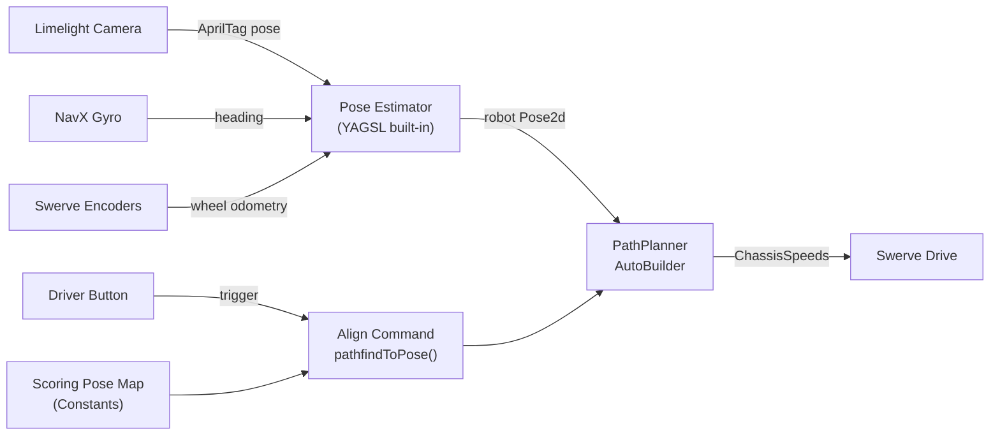

# Limelight AprilTag + PathPlanner Alignment Integration

## Overview

Complete the Limelight vision pose estimation that is partially implemented, configure PathPlanner's AutoBuilder for the YAGSL swerve drive, and create an alignment command framework that uses AprilTag-corrected odometry with PathPlanner's pathfindToPose to drive to scoring positions.

## Architecture Overview



## What You Need to Provide (Measurements/Inputs)

Before implementation, you need to gather these values. Items marked with **[HAVE]** are already in your code; items marked **[NEED]** are still required.

### Camera Mounting [HAVE - verify accuracy]

Current values in `Constants.java` `VisionConstants`:

- X offset: 11.7" forward from robot center
- Y offset: -8.0" left/right from center
- Z offset: 13.2" height
- Pitch: 15 degrees, Roll: 0, Yaw: 0

**Action**: Physically re-measure these on the robot. Even small errors (1-2 inches) will cause the pose estimator to be inaccurate. Measure from the robot's center point to the camera lens.

### Scoring Target Poses [NEED]

For each field element you want to align to, you need a `Pose2d` (x, y in meters on the WPILib Blue-origin field coordinate system, plus a heading angle). These represent where the robot should be positioned to score.

**Action**: Use the PathPlanner GUI app to look up field element positions on the 2025/2026 field map, then define target poses offset from those elements (e.g., 18 inches in front of a reef branch, facing the branch). You can also drive the robot to the desired position manually, read the pose from SmartDashboard, and record it.

### Path-Following PID Constants [NEED]

PathPlanner requires two sets of PID constants:

- **Translation PID**: Controls how accurately the robot follows the X/Y path (start with P=5.0, I=0, D=0)
- **Rotation PID**: Controls how accurately the robot tracks heading (start with P=5.0, I=0, D=0)

These will need tuning on the real robot. The commented-out `AutonConstants` in Constants.java had P=0.7 translation / P=0.4 rotation — these are reasonable starting points too.

### Robot Physical Constraints [HAVE]

- Max speed: 14.5 ft/s (4.42 m/s) — already in `Constants.MAX_SPEED`
- Max module speed: Same as max speed for Krakens
- Drive base radius: ~16.3" (calculable from your 11.5" module offsets) — YAGSL knows this

---

## Step 1: Complete Limelight Vision Pose Estimation

File: `src/main/java/frc/robot/subsystems/SwerveSubsystem.java`

The vision reading logic exists but is not being applied. Changes needed:

- **Add `SetRobotOrientation()` call** before reading the pose estimate — this enables MegaTag2, which uses the gyro heading to produce far more accurate multi-tag pose estimates
- **Uncomment and connect `addVisionMeasurement()`** — use `swerveDrive.addVisionMeasurement()` (YAGSL's built-in method) instead of a raw WPILib pose estimator
- **Set camera pose in robot space** at initialization via `LimelightHelpers.setCameraPose_RobotSpace()` using the values from `VisionConstants`
- **Wire up the filter and pick-best logic** that already exists into the actual measurement call

The corrected `periodic()` flow:

1. Feed gyro heading to Limelight via `SetRobotOrientation()`
2. Read pose estimate via `getBotPoseEstimate_wpiBlue_MegaTag2()` (MegaTag2 is more accurate than MegaTag1)
3. Filter the estimate (existing `filterPoseEstimate()` method)
4. If valid and gyro rate < 720 deg/s, call `swerveDrive.addVisionMeasurement(pose, timestamp)`

## Step 2: Configure PathPlanner AutoBuilder

File: `src/main/java/frc/robot/subsystems/SwerveSubsystem.java`

Add `AutoBuilder.configure()` call in the `SwerveSubsystem` constructor, after the `SwerveDrive` is created. This requires:

```java
AutoBuilder.configure(
    this::getPose,
    this::resetOdometry,
    this::getRobotVelocity,
    (speeds, feedforwards) -> setChassisSpeeds(speeds),
    new PPHolonomicDriveController(
        new PIDConstants(5.0, 0.0, 0.0),   // Translation PID
        new PIDConstants(5.0, 0.0, 0.0)    // Rotation PID
    ),
    RobotConfig.fromGUISettings(),  // or construct manually
    () -> isRedAlliance(),
    this
);
```

Also add PathPlanner PID constants to `Constants.java` under an `AutonConstants` class (uncommenting and updating the existing commented-out section).

**Note**: `RobotConfig.fromGUISettings()` requires running the PathPlanner GUI once and saving a project config for your robot (mass, MOI, module positions, gear ratios). Alternatively, you can construct `RobotConfig` manually in code using values you already have.

## Step 3: Define Scoring Pose Constants

File: `Constants.java`

Create a `FieldPositions` class (or use the existing empty `blueAuto_Map`) with `Pose2d` entries for each scoring location. The existing `AutoDestination` enum + `blueAuto_Map` is a perfect skeleton for this. Placeholder values will be used initially.

Example structure:

- `REEF_LEFT`, `REEF_CENTER`, `REEF_RIGHT` — poses in front of reef scoring positions
- Each pose defined for the Blue alliance origin; PathPlanner handles Red alliance mirroring via the `isRedAlliance()` supplier

## Step 4: Create Alignment Command

New file or added to `RobotContainer.java`

Create a command that uses `AutoBuilder.pathfindToPose()` to drive to the nearest scoring position:

```java
public Command alignToScore(Pose2d targetPose) {
    PathConstraints constraints = new PathConstraints(
        3.0, 3.0,       // max velocity, max accel (m/s, m/s^2)
        Units.degreesToRadians(540), Units.degreesToRadians(720)  // max angular vel, accel
    );
    return AutoBuilder.pathfindToPose(targetPose, constraints);
}
```

Bind this to a driver button (e.g., a trigger or D-pad) in `configureBindings()`.

## Step 5: Uncomment Auto Chooser (Optional)

File: `RobotContainer.java`

Once AutoBuilder is configured, uncomment `AutoBuilder.buildAutoChooser()` to enable PathPlanner's auto selector in the dashboard. This lets you create full autonomous routines in the PathPlanner GUI and select them from SmartDashboard.

---

## Files to Modify

| File                   | Changes                                                               |
| ---------------------- | --------------------------------------------------------------------- |
| `SwerveSubsystem.java` | Complete vision integration, add AutoBuilder.configure()              |
| `Constants.java`       | Add AutonConstants PID values, add FieldPositions scoring poses       |
| `RobotContainer.java`  | Add alignment command, bind to button, optionally enable auto chooser |

## Summary of What You Need to Measure/Decide

1. **Verify camera mount offsets** (X, Y, Z, pitch) by physically measuring on the robot
2. **Decide scoring target poses** — drive robot to desired positions and record the Pose2d, or look up coordinates in the PathPlanner field map
3. **Choose which driver button** triggers alignment
4. **Tune PID values** on the real robot (start with the defaults provided, adjust from there)
5. **Optionally**: Download and run the PathPlanner GUI desktop app, create a project for your robot, and configure the robot settings (mass, dimensions) — this is needed if you want to use `RobotConfig.fromGUISettings()` or create GUI-authored auto paths
